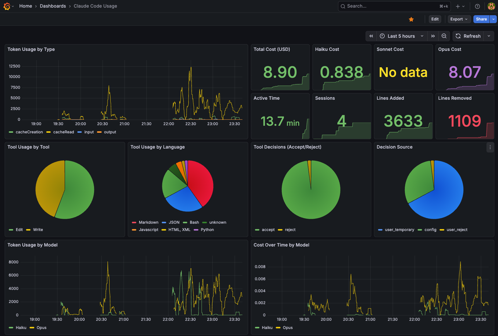
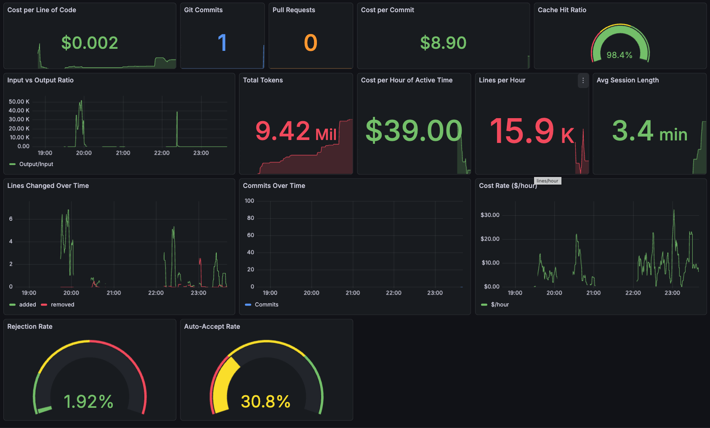

# Claude Pulse

Local monitoring dashboard for Claude Code usage - track costs, tokens, and productivity metrics with OpenTelemetry, Prometheus, and Grafana.




## Features

- **Cost Tracking** - Monitor API costs by model (Haiku, Sonnet, Opus)
- **Token Analytics** - Track input, output, cache read, and cache creation tokens
- **Productivity Metrics** - Lines of code, commits, cost per hour of active time
- **Session Insights** - Active time, session count, average session length
- **Tool Usage** - See which tools (Edit, Write) you use most and acceptance rates
- **Historical Data** - JSON log backup with data replay capability
- **Auto-Restart** - Watchdog ensures services stay running

## Architecture

```
┌─────────────┐     ┌─────────────────┐     ┌────────────┐     ┌─────────┐
│ Claude Code │────▶│  OTel Collector │────▶│ Prometheus │────▶│ Grafana │
└─────────────┘     └─────────────────┘     └────────────┘     └─────────┘
                            │                      │
                            ▼                      ▼
                    JSON log files         Time-series DB
                    (backup/audit)          (persistence)
```

## Requirements

- macOS (Apple Silicon or Intel)
- [Homebrew](https://brew.sh/)
- Claude Code CLI

## Quick Start

### 1. Install

```bash
git clone https://github.com/YOUR_USERNAME/claude-pulse.git
cd claude-pulse
chmod +x install.sh uninstall.sh scripts/*.sh
./install.sh
```

The installer will automatically:
- Install Prometheus, Grafana, and OpenTelemetry Collector
- Configure all services to start automatically
- Add telemetry environment variables to your shell config (~/.zshrc or ~/.bashrc)
- Import the Grafana dashboard
- Set up auto-restart watchdog

### 2. Reload Your Shell

```bash
source ~/.zshrc  # or ~/.bashrc
```

Or just open a new terminal.

### 3. Start Using Claude Code

Run `claude` and start coding. Metrics will automatically flow to your dashboard.

### 4. View Dashboard

- **URL:** http://localhost:65432
- **Login:** admin / admin (change on first login)
- **Dashboard:** Claude Code Usage

## Services

| Service | Port | Purpose |
|---------|------|---------|
| OTel Collector | 4317 (gRPC), 4318 (HTTP) | Receives telemetry from Claude Code |
| Prometheus | 9090 | Time-series metrics storage |
| OTel Prometheus Exporter | 9091 | Exposes metrics for Prometheus to scrape |
| Grafana | 65432 | Dashboard UI |

## Data Persistence

| Component | Persisted | Location |
|-----------|-----------|----------|
| Prometheus | Yes | `/opt/homebrew/var/prometheus/` |
| JSON Logs | Yes | `~/.local/share/otelcol/logs/` |
| Grafana | Yes | `/opt/homebrew/var/lib/grafana/` |
| OTel Collector | No (in-memory) | - |

## Scripts

| Script | Purpose |
|--------|---------|
| `install.sh` | Install and configure all components |
| `uninstall.sh` | Remove all components and data |
| `scripts/import-dashboard.sh` | Import/update Grafana dashboard |
| `scripts/replay-metrics.sh` | Restore historical data from JSON logs |
| `scripts/setup-watchdog.sh` | Configure auto-restart for services |

## Service Management

```bash
# Check status
launchctl list | grep otelcol
brew services list | grep -E "prometheus|grafana"

# Restart services
launchctl kickstart -k gui/$(id -u)/com.otelcol.claude-code
brew services restart prometheus
brew services restart grafana

# View logs
tail -f ~/.local/share/otelcol/logs/otelcol.err
tail -f /opt/homebrew/var/log/prometheus.err.log
tail -f /opt/homebrew/var/log/grafana/grafana.log
```

## Metrics Reference

See [docs/metrics-reference.md](docs/metrics-reference.md) for a complete list of available metrics.

### Key Metrics

| Metric | Description |
|--------|-------------|
| `claude_code.cost.usage` | API cost in USD |
| `claude_code.token.usage` | Token counts by type |
| `claude_code.active_time.total` | Active coding time in seconds |
| `claude_code.session.count` | Session counter |
| `claude_code.lines_of_code.count` | Lines added/removed |

## Troubleshooting

See [docs/troubleshooting.md](docs/troubleshooting.md) for common issues and solutions.

### Quick Fixes

**No data in Grafana:**
1. Verify telemetry env vars are set: `env | grep OTEL`
2. Check OTel Collector is running: `pgrep otelcol`
3. Check Prometheus targets: http://localhost:9090/targets

**Services not starting:**
```bash
# Force start all services
launchctl kickstart gui/$(id -u)/com.otelcol.claude-code
launchctl kickstart gui/$(id -u)/homebrew.mxcl.prometheus
launchctl kickstart gui/$(id -u)/homebrew.mxcl.grafana
```

## Using Claude Code for Diagnosis

Claude Pulse includes a [CLAUDE.md](CLAUDE.md) file that enables Claude Code to diagnose issues and evolve the dashboard. Simply ask Claude Code to:

- **Diagnose the system**: "Check if all Claude Pulse services are running"
- **Query metrics**: "What's my total cost this week?"
- **Verify data flow**: "Is Prometheus receiving data from the OTel Collector?"
- **Update the dashboard**: "Add a panel showing tokens per session"

### Evolving the Dashboard

The `CLAUDE.md` file documents the Grafana and Prometheus APIs, allowing Claude Code to:

1. Query Prometheus to test new metrics
2. Edit `dashboard.json` to add/modify panels
3. Import the updated dashboard via `./scripts/import-dashboard.sh`
4. Verify changes in the browser

Example workflow:
```
You: "Add a panel showing cost breakdown by model as a pie chart"
Claude Code: [Tests query] → [Edits dashboard.json] → [Imports to Grafana]
```

## Uninstall

```bash
./uninstall.sh
```

This removes all services, configurations, and optionally the collected data.

## License

MIT

## Acknowledgments

- [Claude Code](https://claude.ai/code) by Anthropic
- [OpenTelemetry](https://opentelemetry.io/)
- [Prometheus](https://prometheus.io/)
- [Grafana](https://grafana.com/)
